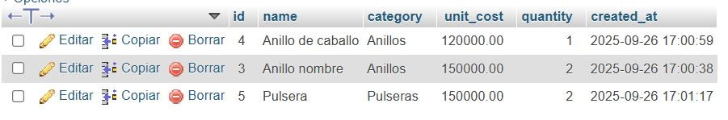
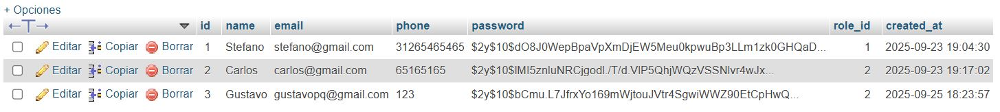
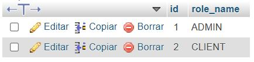

# 🌐 Proyecto Web en InfinityFree – [Marketplace - Joyería]

## 👥 Integrantes y Roles

- [Stefano Arias] – Líder / Coordinador
- [Jorge Iván Hurtado] – Desarrollador Backend
- [Fabián Morales] – Desarrollador Frontend / UI
- [Daniel Pérez] – Desarrollador Backend
- [Santiago Correa] – Desarrollador Frontend / UI
- [Andrés Castro] – Desarrollador Backend
- [Federico Gómez] – Administrador de Base de Datos (DBA)
- [Samuel Acevedo] – DevOps / Deployment
- [Mario Florez] – QA / Tester
- [Gustavo Piedrahita] – Documentador / Presentador

## 📖 Descripción del Proyecto

Este es un sistema web básico para la gestión de productos de una joyería, con funcionalidades de autenticación de usuarios y roles (Administrador y Cliente).

## 🚀 Instrucciones de Uso

1. Subir los archivos a la carpeta `htdocs` o `public_html` en InfinityFree.
2. Configurar la conexión en `db_connect.php` con:
   - Host: `sqlXXX.epizy.com`
   - Usuario: `[usuario asignado]`
   - Contraseña: `[contraseña asignada]`
   - Nombre de la base de datos: `[db asignada]`
3. Ingresar al sitio desde la URL pública:  
   👉 [https://joyeriala16.free.nf]

## 🖼️ Evidencias de Despliegue

- URL del sitio: [https://joyeriala16.free.nf]
- Captura de phpMyAdmin mostrando ≥3 registros (`capturas/phpmyadmin.png`)
- Captura del File Manager con archivos subidos (`capturas/filemanager.png`)
- Captura del sitio funcionando (`capturas/sitio.png`)

## 📂 Archivos Entregados

- `codigo.zip` – Código completo del proyecto
- `dump.sql` – Base de datos exportada
- `qa-report.md` – Reporte de pruebas realizadas
- Carpeta `capturas/` – Evidencias gráficas

## 📝 Changelog (registro de cambios)

- [Nombre] – Implementó validaciones y seguridad con prepared statements.
- [Nombre] – Mejoró la interfaz y organizó assets en carpeta `static/`.
- [Nombre] – Configuró la base de datos y generó `dump.sql`.
- [Nombre] – Subió el proyecto al hosting InfinityFree.
- [Nombre] – Realizó pruebas QA y documentó resultados.
- [Nombre] – Redactó README.md y preparó presentación.

## ❓ Preguntas de Reflexión (Cloud)

1. ¿Qué es despliegue y cómo lo hicieron en este proyecto?

Poner un sistema informático disponible para un usuario.

- Levantamiento de requerimientos y diseño del sistema
- Identificar un proveedor y servicio para el despliegue
- Contratar hosting, definir estructura del aplicativo, elegir y comprar un dominio
- Inicializar y configurar una base de datos
- Desarrollar el sistema y sus funcionalidades de acuerdo a los requerimientos
- Cargar los archivos con el código en el servidor
- Verificar el funcionamiento del aplicativo

2. ¿Qué limitaciones encontraron en InfinityFree?

- Solo usan FTP
- El lenguaje de programación está limitado a PHP
- Solo se puede usar MySQL como motor de base de datos
- El dominio gratuito es genérico
- No es escalable
- La base de datos solo admite un usuario con rol administrador
   
3. ¿Qué servicio equivalente usarían en AWS, Azure o GCP para:

- Archivos estáticos en AWS S3
- Base de datos en AWS RDS
- Hosting del sitio en AWS en S3
   
4. ¿Cómo resolverían escalabilidad y alta disponibilidad en la nube?

Para alta disponibilidad se puede implementar un CDN, al ser un sitio estático el CDN permite que el caché del sitio esté disponible globalmente aumentando la velocidad de carga y el acceso al sistema.

También se puede usar S3 para garantizar la escalabilidad de la aplicación ya que cuenta con una funcionalidad de auto-scaling que permite que se aumente el número de servidores disponibles.

5. Plan de migración en 4–5 pasos desde InfinityFree hacia un servicio en la nube.

- Exportar la información registrada en la base de datos desde InfinityFree
- Aprovisionar los servicios en el proveedor por ejemplo en AWS serían S3 para el código y RDS para la base de datos.
- Se configuran las variables de entorno en el servicio secret manager para conectar la base de datos con el servicio de s3.
- Importar la base de datos en RDS
- Importar código en el servicio de S3
- Realizar pruebas de verificación de funcionamiento

# README Viejo

## Tabla de Contenidos

- [Características](#características)
- [Tecnologías Utilizadas](#tecnologías-utilizadas)
- [Configuración del Proyecto](#configuración-del-proyecto)
  - [Requisitos Previos](#requisitos-previos)
  - [Configuración de la Base de Datos](#configuración-de-la-base-de-datos)
  - [Configuración de la Aplicación](#configuración-de-la-aplicación)
- [Uso](#uso)
- [Estructura del Proyecto](#estructura-del-proyecto)

## Características

- Autenticación de usuarios (registro, inicio de sesión, cierre de sesión).
- Roles de usuario: Administrador y Cliente.
- Gestión de productos (añadir, editar, eliminar) para administradores.
- Visualización de productos para clientes.

## Tecnologías Utilizadas

- **Backend:** PHP
- **Base de Datos:** MySQL
- **Frontend:** HTML, CSS

## Configuración del Proyecto

### Requisitos Previos

Asegúrate de tener instalado lo siguiente en tu entorno de desarrollo:

- Servidor web (por ejemplo, Apache, Nginx)
- PHP (versión 7.4 o superior recomendada)
- MySQL o MariaDB

### Configuración de la Base de Datos

1.  **Crear la Base de Datos:**
    Crea una base de datos con el nombre `if0_40011441_joyeria_la_16`. Puedes usar phpMyAdmin, MySQL Workbench o la línea de comandos de MySQL.

2.  **Crear Tablas:**
    Ejecuta las siguientes sentencias SQL para crear las tablas `roles`, `users` y `products`:

    ```sql
    -- Tabla de roles
    CREATE TABLE roles (
        id INT AUTO_INCREMENT PRIMARY KEY,
        role_name VARCHAR(50) NOT NULL UNIQUE
    );

    INSERT INTO roles (role_name) VALUES ('ADMIN'), ('CLIENT');

    -- Tabla de usuarios
    CREATE TABLE users (
        id INT AUTO_INCREMENT PRIMARY KEY,
        name VARCHAR(100) NOT NULL,
        email VARCHAR(100) UNIQUE NOT NULL,
        phone VARCHAR(20),
        password VARCHAR(255) NOT NULL,
        role_id INT NOT NULL,
        created_at TIMESTAMP DEFAULT CURRENT_TIMESTAMP,
        FOREIGN KEY (role_id) REFERENCES roles(id)
    );

    -- Tabla de productos
    CREATE TABLE products (
        id INT AUTO_INCREMENT PRIMARY KEY,
        name VARCHAR(100) NOT NULL,
        category VARCHAR(50) NOT NULL,
        unit_cost DECIMAL(10,2) NOT NULL,
        quantity INT NOT NULL,
        created_at TIMESTAMP DEFAULT CURRENT_TIMESTAMP
    );

    -- Opcional: Insertar un usuario administrador por defecto (contraseña: admin123)
    -- Para generar el hash de la contraseña 'admin123', puedes usar el siguiente código PHP:
    -- <?php echo password_hash('admin123', PASSWORD_DEFAULT); ?>
    -- Luego, reemplaza el hash en la siguiente línea:
    -- INSERT INTO `users` (`name`, `email`, `phone`, `password`, `role_id`) VALUES ('Admin User', 'admin@example.com', '123456789', 'HASH_GENERADO_PARA_ADMIN123', 1);
    ```

### Configuración de la Aplicación

1.  **Actualizar `config.php`:**
    Asegúrate de que los detalles de conexión en `config.php` coincidan con tu configuración de base de datos local.

    ```php
    <?php
    $servername = "localhost"; // O la dirección de tu servidor de base de datos
    $username   = "tu_usuario";
    $password   = "tu_contraseña";
    $dbname     = "if0_40011441_joyeria_la_16";

    $conn = new mysqli($servername, $username, $password, $dbname);
    if ($conn->connect_error) {
        die("Error de conexión: " . $conn->connect_error);
    }
    ?>
    ```

## Uso

1.  Sube todos los archivos del proyecto a la raíz de tu servidor web (por ejemplo, `htdocs` para Apache).
2.  Abre `index.php` en tu navegador web (por ejemplo, `http://localhost/Joyeria%20la%2016/index.php`).
3.  **Registro:** Regístrate como un nuevo usuario. Por defecto, los usuarios se registran con el rol de `CLIENTE`.
4.  **Inicio de Sesión:** Inicia sesión con tus credenciales.
5.  **Administrador:** Si deseas un usuario administrador, puedes modificar el `role_id` del usuario directamente en la tabla `users` de tu base de datos a `1` (que corresponde al rol `ADMIN`).

## Estructura del Proyecto

- `add_product.php`: Formulario y lógica para añadir nuevos productos (solo administradores).
- `config.php`: Archivo de configuración de la base de datos.
- `delete_product.php`: Lógica para eliminar productos (solo administradores).
- `edit_product.php`: Formulario y lógica para editar productos existentes (solo administradores).
- `home.php`: Página principal después del inicio de sesión, muestra productos.
- `index.php`: Página de inicio, redirige a login o home.
- `login.php`: Formulario y lógica de inicio de sesión.
- `logout.php`: Lógica para cerrar la sesión.
- `README.md`: Este archivo.
- `register.php`: Formulario y lógica de registro de usuarios.
- `style.css`: Hoja de estilos CSS para la aplicación.

## Evidencias

### Anillos


### Usuarios


### Roles


## Script de la Base de Datos

```sql
-- phpMyAdmin SQL Dump
-- version 4.9.0.1
-- https://www.phpmyadmin.net/
--
-- Servidor: sql213.infinityfree.com
-- Tiempo de generación: 26-09-2025 a las 20:04:18
-- Versión del servidor: 11.4.7-MariaDB
-- Versión de PHP: 7.2.22

SET SQL_MODE = "NO_AUTO_VALUE_ON_ZERO";
SET AUTOCOMMIT = 0;
START TRANSACTION;
SET time_zone = "+00:00";


/*!40101 SET @OLD_CHARACTER_SET_CLIENT=@@CHARACTER_SET_CLIENT */;
/*!40101 SET @OLD_CHARACTER_SET_RESULTS=@@CHARACTER_SET_RESULTS */;
/*!40101 SET @OLD_COLLATION_CONNECTION=@@COLLATION_CONNECTION */;
/*!40101 SET NAMES utf8mb4 */;

--
-- Base de datos: `if0_40011441_joyeria_la_16`
--

-- --------------------------------------------------------

--
-- Estructura de tabla para la tabla `products`
--

CREATE TABLE `products` (
  `id` int(11) NOT NULL,
  `name` varchar(100) NOT NULL,
  `category` varchar(50) NOT NULL,
  `unit_cost` decimal(10,2) NOT NULL,
  `quantity` int(11) NOT NULL,
  `created_at` timestamp NULL DEFAULT current_timestamp()
) ENGINE=MyISAM DEFAULT CHARSET=latin1 COLLATE=latin1_swedish_ci;

--
-- Volcado de datos para la tabla `products`
--

INSERT INTO `products` (`id`, `name`, `category`, `unit_cost`, `quantity`, `created_at`) VALUES
(4, 'Anillo de caballo', 'Anillos', '120000.00', 1, '2025-09-27 00:00:59'),
(3, 'Anillo nombre', 'Anillos', '150000.00', 2, '2025-09-27 00:00:38'),
(5, 'Pulsera', 'Pulseras', '150000.00', 2, '2025-09-27 00:01:17');

-- --------------------------------------------------------

--
-- Estructura de tabla para la tabla `roles`
--

CREATE TABLE `roles` (
  `id` int(11) NOT NULL,
  `role_name` varchar(50) NOT NULL
) ENGINE=MyISAM DEFAULT CHARSET=latin1 COLLATE=latin1_swedish_ci;

--
-- Volcado de datos para la tabla `roles`
--

INSERT INTO `roles` (`id`, `role_name`) VALUES
(1, 'ADMIN'),
(2, 'CLIENT');

-- --------------------------------------------------------

--
-- Estructura de tabla para la tabla `users`
--

CREATE TABLE `users` (
  `id` int(11) NOT NULL,
  `name` varchar(100) NOT NULL,
  `email` varchar(100) NOT NULL,
  `phone` varchar(20) DEFAULT NULL,
  `password` varchar(255) NOT NULL,
  `role_id` int(11) NOT NULL,
  `created_at` timestamp NULL DEFAULT current_timestamp()
) ENGINE=MyISAM DEFAULT CHARSET=latin1 COLLATE=latin1_swedish_ci;

--
-- Volcado de datos para la tabla `users`
--

INSERT INTO `users` (`id`, `name`, `email`, `phone`, `password`, `role_id`, `created_at`) VALUES
(1, 'Stefano', 'stefano@gmail.com', '31265465465', '$2y$10$dO8J0WepBpaVpXmDjEW5Meu0kpwuBp3LLm1zk0GHQaDSKs8szJlDe', 1, '2025-09-24 02:04:30'),
(2, 'Carlos', 'carlos@gmail.com', '65165165', '$2y$10$lMI5znluNRCjgodl./T/d.VlP5QhjWQzVSSNlvr4wJxH5cZHlTw/O', 2, '2025-09-24 02:17:02'),
(3, 'Gustavo', 'gustavopq@gmail.com', '123', '$2y$10$bCmu.L7JfrxYo169mWjtouJVtr4SgwiWWZ90EtCpHwQNtkG1GyOoa', 2, '2025-09-26 01:23:57');

--
-- Índices para tablas volcadas
--

--
-- Indices de la tabla `products`
--
ALTER TABLE `products`
  ADD PRIMARY KEY (`id`);

--
-- Indices de la tabla `roles`
--
ALTER TABLE `roles`
  ADD PRIMARY KEY (`id`),
  ADD UNIQUE KEY `role_name` (`role_name`);

--
-- Indices de la tabla `users`
--
ALTER TABLE `users`
  ADD PRIMARY KEY (`id`),
  ADD UNIQUE KEY `email` (`email`),
  ADD KEY `role_id` (`role_id`);

--
-- AUTO_INCREMENT de las tablas volcadas
--

--
-- AUTO_INCREMENT de la tabla `products`
--
ALTER TABLE `products`
  MODIFY `id` int(11) NOT NULL AUTO_INCREMENT, AUTO_INCREMENT=6;

--
-- AUTO_INCREMENT de la tabla `roles`
--
ALTER TABLE `roles`
  MODIFY `id` int(11) NOT NULL AUTO_INCREMENT, AUTO_INCREMENT=3;

--
-- AUTO_INCREMENT de la tabla `users`
--
ALTER TABLE `users`
  MODIFY `id` int(11) NOT NULL AUTO_INCREMENT, AUTO_INCREMENT=4;
COMMIT;

/*!40101 SET CHARACTER_SET_CLIENT=@OLD_CHARACTER_SET_CLIENT */;
/*!40101 SET CHARACTER_SET_RESULTS=@OLD_CHARACTER_SET_RESULTS */;
/*!40101 SET COLLATION_CONNECTION=@OLD_COLLATION_CONNECTION */;
```
